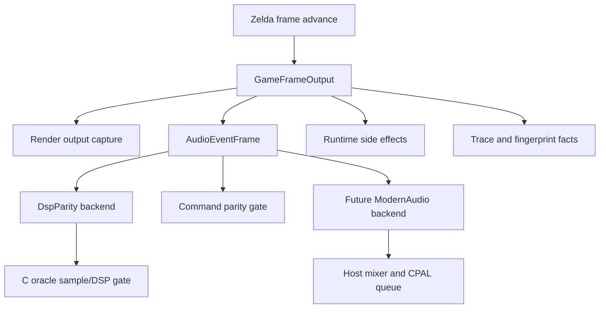
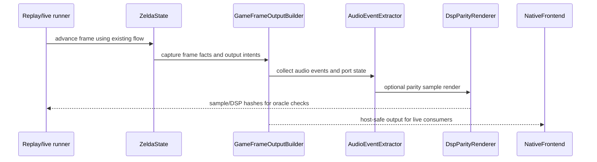

# refactor: Add typed game output boundary before modern audio

## Goal Capsule

| Field | Value |
|---|---|
| Objective | Introduce a typed per-frame game output boundary so rendering, audio, save/runtime side effects, diagnostics, and future host features consume explicit frame outputs instead of hidden APU/SPC/DSP side channels. |
| Authority | C oracle parity remains the highest authority for game behavior; the new typed boundary must initially mirror existing behavior, not reinterpret it. |
| Execution profile | Deep, cross-cutting refactor with characterization-first proof. |
| Stop condition | The default runtime still behaves like today, audio parity tooling still passes through the existing DSP-compatible renderer, and a modern audio backend can be added later without reaching into SPC RAM or DSP write history. |
| Tail ownership | Follow-up work owns default modern synth/sample playback and audio asset authoring once this boundary is proven. |

---

## Product Contract

### Summary

Rendering modernization has created an increasingly clear frame model and backend choice, but audio and other side effects still travel through legacy-shaped state: APU ports, SPC RAM mirrors, DSP register writes, queue state, and host-sized sample buffers.
This plan creates a modern typed output boundary first.
The immediate product value is not new sound; it is a stable architecture where default live audio can later become modern without weakening parity.

### Problem Frame

The current audio path mixes several responsibilities in one flow: game code writes APU ports, the translated SPC player consumes queued port state, the DSP-compatible renderer advances samples, and host playback receives a buffer sized to the live audio device.
That path is useful for C parity, but it is the wrong default programming model for modern audio.
If the project replaces the DSP path directly, it risks breaking gameplay-visible APUI handshakes or losing the oracle that proves audio behavior.
If the project keeps programming against DSP registers, it never reaches the desired modern model.

The missing layer is a typed frame output contract: per-frame facts and intents emitted by the game core, with legacy parity renderers and modern live backends as separate consumers.

### Requirements

- R1. The game core exposes a typed per-frame output object that includes render capture, audio events, audio port/handshake state, save/runtime output hooks, and diagnostic metadata.
- R2. Existing live behavior remains unchanged while the typed output path is introduced; current rendering, replay, save-state, and audio output callers keep working during migration.
- R3. Audio sequencing intent is represented as typed events before any backend renders samples.
- R4. DSP-compatible sample rendering remains available for parity and opt-in debugging, but new default-facing APIs do not require callers to program DSP registers or SPC RAM.
- R5. The C oracle audio comparison remains intact and gains a command-level comparison surface alongside the existing sample/DSP hash comparison.
- R6. The output boundary is checkpoint/replay safe: any new state included in checkpoints is deterministic, serializable where needed, and does not depend on host audio device shape.
- R7. Host playback concerns such as CPAL device sample rate, queue depth, volume ducking, and resampling stay outside the parity-sensitive game core.
- R8. The plan does not change the interactive default audio synthesis yet; it creates the boundary needed to do that in a later plan.

### Acceptance Examples

- AE1. Given a normal replay frame, when the game advances, then the frame output contains the same render-visible state and audio command/handshake facts that the existing trace path can print today.
- AE2. Given a parity replay, when the DSP parity backend consumes the typed audio events, then the existing audio sample hash, DSP pre/post hash, and DSP write hashes still match the C oracle.
- AE3. Given live play on a host with a non-32 kHz CPAL device, when audio is pushed to the frontend, then host sample-rate adaptation happens outside the game output contract.
- AE4. Given a future modern audio backend, when it consumes a frame output, then it can play music/SFX from typed events without reading SPC RAM, DSP registers, or `DspState`.

### Scope Boundaries

In scope:

- A typed per-frame output model and compatibility extraction from the current runtime.
- A typed audio event/plan model that captures intent and backend-neutral timing.
- A backend selector that keeps `DspParity` explicit and makes room for `Modern` later.
- Parity tooling updates that compare typed command output before sample rendering.
- Documentation of the new boundary and the rules for adding future output consumers.

Deferred to follow-up work:

- Making the modern audio backend the default.
- Authoring named song/instrument/sample assets or replacing BRR assets with WAV/Opus equivalents.
- Removing the DSP-compatible renderer from the codebase.
- Replacing full `snes::apu::ApuState`; it stays useful as compatibility/debug infrastructure.
- Reworking all rendering modernization around this output object in one pass. This plan adds the boundary and migrates callers incrementally.

Outside this product's identity:

- Weakening byte/sample parity claims by accepting approximate audio as equivalent to DSP parity.
- Using snes9x/TAS as the primary oracle for this work; the local C checkout remains the authority.

---

## Planning Contract

### Key Technical Decisions

- KTD1. Introduce the typed output boundary before changing live audio synthesis.
  The high-risk part is not CPAL or mixing; it is preserving gameplay-visible side effects while moving callers away from hardware-shaped state.
- KTD2. Keep DSP-compatible rendering as a backend, not as the programming model.
  Sample-exact output still requires DSP-equivalent math, but the default-facing API should speak in tracks, SFX, voices, envelopes, pan, echo, and timing.
- KTD3. Treat APUI/port handshakes as game-visible output, not host audio implementation detail.
  `zelda_apu_read`, `zelda_apu_write`, `zelda_push_apu_state`, and queued port behavior must remain parity-owned until an explicit semantic replacement is proven.
- KTD4. Use characterization tests around current traces before refactoring.
  Existing audio parity has historically caught subtle state/timing bugs, so the first implementation units should pin current behavior.
- KTD5. Keep host sample-rate adaptation downstream.
  The stable game output should be at the internal frame/audio-event level; live device sample count and queue shape belong in `crates/platform`.
- KTD6. Make command parity a first-class gate before changing output sound.
  A modern backend can intentionally sound different later, but it must consume events whose original intent still matches C.

### High-Level Technical Design

The first implementation should produce `GameFrameOutput` as a compatibility layer over the current runtime.
It should not require every caller to switch immediately.
The typed object becomes authoritative only after tests prove it mirrors existing behavior.

The backend mode should be explicit:

| Mode | Purpose | Parity authority |
|---|---|---|
| `DspParity` | Existing C-compatible sample rendering and replay/oracle gates | Sample hash, DSP pre/post hash, DSP write hashes |
| `CommandTrace` | Typed command/event comparison without rendering samples | Event hash, APUI/port state, music/SFX command state |
| `Modern` | Future live synthesis/sample playback | Gameplay/event parity only; sonic output intentionally separate |

### Assumptions

- The current C audio oracle is still the correct parity authority for this repo.
- The initial typed output model can be additive: no caller must be forced through it before characterization coverage exists.
- A future modern audio backend will not claim sample-exact parity unless it routes through `DspParity` or an equivalent renderer.

### System-Wide Impact

This work changes the architecture contract for frame outputs.
It affects `crates/zelda3` as the source of game output, `zelda3-bin` as the main replay/live runner, `crates/platform` as host output, `crates/snes` as the DSP/APU compatibility layer, and the parity scripts that compare C and Rust.
It also creates a new rule for future modernization: output consumers should depend on typed frame output first, not on raw WRAM, SPC RAM, DSP registers, or host callback state.

### Risks & Dependencies

| Risk | Mitigation |
|---|---|
| The typed event model accidentally omits a gameplay-visible APUI or queue detail. | Start with characterization tests against current trace output and add command hashes before replacing callers. |
| Audio events become too DSP-shaped and fail to improve programmability. | Keep the IR names domain-level: track, SFX, voice, envelope, pan, echo, pitch, priority, timing. Store DSP registers only as parity annotations. |
| Output object grows into a dump of every runtime detail. | Split stable product fields from diagnostics; make diagnostic payloads opt-in or trace-only. |
| Checkpoints diverge because new output state is host-shaped. | Do not serialize host queue/device state into game checkpoints; serialize only deterministic game output state when needed. |
| Scope expands into default modern audio playback too early. | Keep backend replacement deferred until command parity and typed output consumers are proven. |

### Sources & Research

- `crates/zelda3/src/audio.rs` owns the current `zelda_render_audio`, APU queue, audio snapshot, MSU mixing, and debug routes.
- `crates/zelda3/src/spc_player.rs` owns the translated SPC player and wraps `snes::apu::DspState`.
- `crates/snes/src/apu.rs` contains the compatibility APU/DSP/SPC implementation and fixed 534-sample internal frame boundary.
- `zelda3-bin/src/audio_trace.rs` already defines the important parity facts: sample checksum, DSP pre/post hash, DSP write count/hash/value hash.
- `zelda3-bin/src/main.rs` contains replay/live call sites that currently render audio directly into sample buffers.
- `crates/platform/src/lib.rs` owns host CPAL queueing, sample-rate-derived `audio_samples_per_frame`, audio ducking, and host playback.
- `docs/porting/semantic_parity_status.md` states that PPU and audio behavior remain output-gated separately from gameplay semantics.
- `README.md` documents `scripts/full_parity.py` and `scripts/compare_c_audio.py` as current C audio oracle gates.

---

## Implementation Units

### U1. Characterize Current Frame Output and Audio Facts

- **Goal:** Pin the current runtime facts that the typed boundary must preserve before adding new abstractions.
- **Requirements:** R1, R2, R5, R6; covers AE1 and AE2.
- **Dependencies:** none.
- **Files:** `zelda3-bin/src/audio_trace.rs`, `zelda3-bin/src/main.rs`, `scripts/compare_c_audio.py`, `scripts/compare_c_audio_route.py`, `scripts/test_standard_replay_parity.py`, new focused tests under the existing binary or parity test structure.
- **Approach:** Factor the current audio trace quantities into a reusable internal summary type that can be compared by tests and printed by existing trace commands. Keep the printed JSON stable. Add tests that prove summary hashes match the current trace path for representative frames.
- **Execution note:** Characterization-first. Do not introduce the new output model until the existing trace fields are pinned.
- **Patterns to follow:** `AudioFrameStats`, `fingerprint_audio_hash`, `replay_checksum_dsp_writes`, and the C route comparison scripts.
- **Test scenarios:**
  - Given a frame with no DSP writes, summary generation reports zero write count, stable hashes, and unchanged sample checksum behavior.
  - Given a frame with DSP writes, summary generation includes sample offsets and timer cycles in the write hash exactly like the current trace path.
  - Given startup audio trace JSON, existing fields remain byte-for-byte parse-compatible for `compare_c_audio.py`.
  - Given route comparison with `--state-only`, command-state fields remain independent from rendered sample fields.
- **Verification:** Existing audio trace scripts still compare C/Rust, and focused tests prove the reusable summary matches the old trace path.

### U2. Add `GameFrameOutput` as an Additive Compatibility Object

- **Goal:** Create a typed per-frame output container without changing existing live/replay behavior.
- **Requirements:** R1, R2, R6, R7; covers AE1 and AE3.
- **Dependencies:** U1.
- **Files:** new module in `crates/zelda3/src/` for frame output types, `crates/zelda3/src/lib.rs`, `crates/zelda3/src/main.rs`, `zelda3-bin/src/main.rs`, focused tests in `crates/zelda3/src/`.
- **Approach:** Add a small `GameFrameOutput` with substructures for render facts, audio facts, runtime side effects, and diagnostics. Initially populate it from existing state after the frame advances. Do not move rendering/audio execution yet. Keep host-only fields out of the object.
- **Technical design:** Directional field groups: `render`, `audio`, `runtime`, `diagnostics`. `audio` should hold command/port facts and an optional parity summary reference, not host sample buffers.
- **Patterns to follow:** Existing semantic snapshot style in `--trace-semantic-state`, `GpuFrame` capture boundaries, and `ZeldaState` debug summary helpers.
- **Test scenarios:**
  - Given a fresh `ZeldaState`, building output for a silent frame produces deterministic empty/default substructures.
  - Given a frame after `zelda_push_apu_state`, output captures the same queued/pending/input port facts as `zelda_audio_route_debug_json`.
  - Given checkpoint save/restore, output generation after restore produces the same deterministic facts as from-scratch playback for the same frame.
  - Given live host configuration with different audio sample counts, `GameFrameOutput` does not change shape or values.
- **Verification:** The object is available to callers, but no existing behavior changes and existing parity gates keep passing.

### U3. Introduce `AudioEventFrame` and Domain-Level Audio Events

- **Goal:** Represent audio intent as typed events before backend rendering.
- **Requirements:** R3, R4, R5, R8; covers AE4.
- **Dependencies:** U1, U2.
- **Files:** new audio event module under `crates/zelda3/src/`, `crates/zelda3/src/audio.rs`, `crates/zelda3/src/spc_player.rs`, `crates/zelda3/src/spc_player_tests.rs`, `crates/zelda3/src/audio_tests.rs`.
- **Approach:** Start with a compatibility extractor that observes the current sequencer/DSP write path and emits domain-level events where intent is knowable. Preserve lower-level parity annotations beside events when needed. The first pass should prefer accurate coverage over perfect elegance: typed track/SFX/voice/volume/pitch/echo events plus raw annotations for unresolved writes.
- **Technical design:** Directional event families: music control, SFX trigger, voice key on/off, voice parameter change, envelope change, pitch/pan change, echo/noise/modulation change, unresolved parity annotation.
- **Patterns to follow:** `DspRegWriteHistory`, `zelda_audio_route_debug_json`, SPC player channel fields, and MSU tests for externally sourced music behavior.
- **Test scenarios:**
  - Given a music-control change, the event frame includes a track/music event and preserves APUI state.
  - Given a SFX command on ports 1/2/3, the event frame identifies the affected SFX channel or records an unresolved annotation with the original port data.
  - Given a voice key-on write, the event frame includes voice identity, timing within the 534-sample frame, and parity annotation for the originating DSP write.
  - Given echo or FIR register changes, the event frame includes an echo-domain event or a clearly marked unresolved parity annotation.
  - Given unknown/unmapped DSP writes, the event frame does not drop them; it records them as unresolved parity annotations so command parity can still fail loudly if they diverge.
- **Verification:** Event extraction is deterministic, test-covered, and does not change the sample output path.

### U4. Add Command-Level Audio Parity Hashing

- **Goal:** Compare typed audio events against C/Rust command behavior before sample rendering.
- **Requirements:** R3, R5, R6; covers AE1 and AE2.
- **Dependencies:** U3.
- **Files:** `zelda3-bin/src/audio_trace.rs`, `zelda3-bin/src/main.rs`, `scripts/compare_c_audio.py`, `scripts/compare_c_audio_route.py`, C oracle trace hooks in the sibling C checkout when needed, tests for hash stability.
- **Approach:** Add a stable event hash and event-count fields to audio trace output while preserving current fields. Start by hashing the Rust event frame and, if C cannot emit the same typed event immediately, hash the compatibility facts both runtimes already expose. Move toward typed event comparison as the C hook surface allows.
- **Execution note:** Keep this additive and backwards compatible; the sample/DSP parity gate remains authoritative.
- **Patterns to follow:** `fingerprint_audio_hash`, `replay_checksum_dsp_writes`, route trace comparison field lists.
- **Test scenarios:**
  - Given identical event frames, command hash is stable across runs and independent of host sample rate.
  - Given a changed voice timing annotation, command hash changes even if high-level music control fields are unchanged.
  - Given legacy C trace output without command hash, comparison scripts either skip the new field by version or report a clear missing-field error in strict mode.
  - Given strict typed-command mode, a mismatch reports frame, field, and trace file locations like current audio route failures.
- **Verification:** Existing C audio scripts still pass in default mode, and strict command comparison can be enabled for frames where both sides emit the new field.

### U5. Split Audio Backends Behind an Explicit Mode

- **Goal:** Make DSP parity a named backend rather than the implicit audio engine surface.
- **Requirements:** R4, R7, R8; covers AE3 and AE4.
- **Dependencies:** U2, U3, U4.
- **Files:** `crates/zelda3/src/audio.rs`, `crates/zelda3/src/spc_player.rs`, `zelda3-bin/src/main.rs`, `zelda3-bin/src/play_commands.rs`, `crates/platform/src/lib.rs`, focused backend-selection tests.
- **Approach:** Introduce an audio backend enum or equivalent selector with at least `DspParity` and `TraceOnly`. Keep `DspParity` as the default behavior during this plan. Route host playback through a small adapter so later `Modern` can consume `AudioEventFrame` without touching DSP state. Keep CPAL queueing downstream.
- **Technical design:** The selector should choose how samples are produced, not how gameplay-visible APUI state advances. APUI/queue state remains advanced by the game-side compatibility layer.
- **Patterns to follow:** Renderer mode selection in `play_renderer`, `NativeFrontend` host audio queueing, and existing env/CLI renderer opt-in posture.
- **Test scenarios:**
  - Given default backend selection, live and replay audio samples match the current DSP path.
  - Given trace-only backend selection in a headless diagnostic mode, event frames are emitted without requiring host audio output.
  - Given a host with mono or nonstandard device channels, backend selection does not change game output facts.
  - Given `DspParity`, existing sample/DSP trace fields remain populated.
- **Verification:** The runtime has a clear backend seam, but default live behavior remains unchanged.

### U6. Migrate Replay and Live Call Sites to Consume `GameFrameOutput`

- **Goal:** Start using the typed boundary in real runners without a big-bang rewrite.
- **Requirements:** R1, R2, R6, R7; covers AE1 and AE3.
- **Dependencies:** U2, U5.
- **Files:** `zelda3-bin/src/main.rs`, `zelda3-bin/src/play_renderer.rs`, `zelda3-bin/src/play_commands.rs`, `zelda3-bin/src/gpu_capture.rs`, `zelda3-bin/src/gpu_compare.rs`, `crates/platform/src/lib.rs`, integration tests or smoke tests covering replay/live paths.
- **Approach:** Update selected call sites to request or receive `GameFrameOutput` after advancing the frame, then pass its render/audio facts to existing consumers. Start with replay diagnostics and trace paths, then live play. Do not force every renderer path through the new object until the migrated paths prove stable.
- **Patterns to follow:** Existing GPU capture/readback modules and modern index comparison output-line pattern.
- **Test scenarios:**
  - Given replay trace mode, output lines generated from `GameFrameOutput` match legacy trace fields.
  - Given live play, audio samples are still produced and pushed to `NativeFrontend` with the same queue behavior as before.
  - Given GPU compare/readback paths, render diagnostics remain unaffected by the presence of frame output audio data.
  - Given save/load checkpoint flows, output generation after load does not mutate game state or host state.
- **Verification:** Migrated paths produce the same observable output as before, and unmigrated paths still compile and run.

### U7. Document Boundary Rules and Ratchets

- **Goal:** Make the new architecture durable for future audio modernization.
- **Requirements:** R1, R4, R7, R8.
- **Dependencies:** U2, U3, U5, U6.
- **Files:** new or updated documentation under `docs/porting/`, `docs/porting/semantic_parity_status.md`, possible source-boundary checks in `scripts/check_renderer_source_boundaries.py` or a sibling script.
- **Approach:** Document that new audio consumers should depend on typed event frames, not SPC RAM/DSP registers. Add a lightweight source-boundary check if practical to prevent new live/default code from reaching directly into parity-only DSP structures.
- **Patterns to follow:** Existing renderer source boundary checker and semantic parity status documentation.
- **Test scenarios:**
  - Given boundary-check script input, direct default-path references to parity-only DSP APIs are reported with actionable file names.
  - Given parity/debug modules, allowed DSP references are not flagged.
  - Given documentation review, the doc distinguishes current parity backend from future modern live backend.
- **Verification:** Future implementers can tell where to attach modern audio work and which APIs are parity-only.

---

## Verification Contract

| Gate | Applies to | Done signal |
|---|---|---|
| Focused `zelda3` audio tests | U1, U3, U5 | Audio state, event extraction, and MSU/SPC tests pass. |
| Focused `zelda3-bin` trace tests or smoke paths | U1, U4, U6 | Trace output remains parse-compatible and new fields are stable. |
| `cargo check -p zelda3-bin` with generated assets configured | U2, U5, U6 | Binary compiles with new output/backend seams. |
| `scripts/compare_c_audio.py` | U1, U4, U5 | Startup C audio oracle still passes. |
| `scripts/compare_c_audio_route.py` | U4, U5, U6 | Full-route audio trace comparison still passes or reports only intentionally gated new strict fields. |
| `scripts/validate_all_parity.py` | Whole plan | All-layer C oracle gate remains green for the configured smoke/full scope. |
| Source-boundary check | U7 | Default-facing code does not newly depend on parity-only DSP internals. |

---

## Definition of Done

- `GameFrameOutput` exists and can be built deterministically from current runtime state.
- `AudioEventFrame` exists and represents known audio intent at a domain level, with unresolved parity annotations for any still-DSP-shaped facts.
- Existing DSP-compatible audio parity remains available and unchanged in default behavior during this plan.
- Audio trace tooling can compare the old sample/DSP facts and the new command/event facts.
- At least one replay/trace path and one live path consume the typed boundary without changing observable behavior.
- Host audio queueing and sample-rate adaptation remain outside the game output contract.
- Documentation states how future modern audio backend work should attach to the event boundary.
- Abandoned experimental code and temporary diagnostics are removed before the work is considered complete.

---

## Appendix

### Future Modern Audio Backend Sketch

After this plan, a follow-up can add `AudioBackend::Modern` without changing the game core again.
That backend should consume `AudioEventFrame`, map tracks/SFX/instruments to modern assets, mix at a stable internal rate, then resample for host output in `crates/platform`.
It should be allowed to differ sonically from the DSP path in live play, while `DspParity` remains the authority for exact C audio comparisons.
